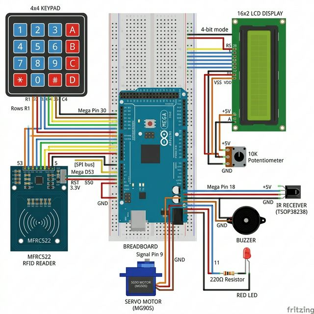

# 🔐 Smart Door Lock System — Complete Technical Manual

> **Arduino Mega 2560** | Multi-Factor Authentication | Servo Bolt | 16×2 LCD | Web Dashboard



---

## 📋 Table of Contents
1. [System Overview](#system-overview)
2. [Bill of Materials](#bill-of-materials)
3. [Complete Wiring Guide](#complete-wiring-guide)
4. [Code Architecture](#code-architecture)
5. [Serial Protocol](#serial-protocol)
6. [Web Dashboard](#web-dashboard)
7. [Setup & Installation](#setup--installation)
8. [Troubleshooting](#troubleshooting)

---

## 1. System Overview

This is a multi-factor smart door lock that allows access through **four independent methods**:

| Method | Input Device | Verification |
|---|---|---|
| **RFID** | MFRC522 Reader | Master UID comparison |
| **Keypad** | 4×4 Membrane | 4-digit PIN + `#` commit |
| **IR Remote** | TSOP38238 Receiver | Hex code match |
| **Web Dashboard** | Browser (Flask) | WebSocket command |

When access is granted, a **servo motor** rotates 90° to retract the bolt. A **16×2 LCD** displays real-time status. The system **auto-relocks after 5 seconds** using a non-blocking timer.

---

## 2. Bill of Materials

| # | Component | Qty | Specs |
|---|---|---|---|
| 1 | Arduino Mega 2560 | 1 | ATmega2560, 54 digital I/O |
| 2 | MFRC522 RFID Module | 1 | 13.56 MHz, SPI interface |
| 3 | RFID Card/Tag | 1+ | Mifare 1KB (13.56 MHz only!) |
| 4 | 4×4 Membrane Keypad | 1 | 8-pin ribbon cable |
| 5 | SG90 Servo Motor | 1 | 5V, 180° rotation |
| 6 | 16×2 LCD Display | 1 | HD44780, parallel 4-bit mode |
| 7 | 10kΩ Potentiometer | 1 | For LCD contrast (VO pin) |
| 8 | IR Receiver (TSOP38238) | 1 | 38kHz, 3-pin |
| 9 | Active Buzzer | 1 | 5V |
| 10 | Red LED (5mm) | 1 | Standard |
| 11 | 220Ω Resistor | 1 | Current limiter for LED |
| 12 | Breadboard + Jumper Wires | - | Male-to-male, male-to-female |

---

## 3. Complete Wiring Guide

### 3.1 RFID Reader (MFRC522) → Arduino Mega

The RFID module uses the **SPI protocol**. On the Mega, SPI pins are fixed at 50–53.

| MFRC522 Pin | Wire Color | Arduino Mega Pin | Notes |
|---|---|---|---|
| **SDA (SS)** | Green | **53** | Chip Select — tells the module "I'm talking to you" |
| **SCK** | Yellow | **52** | Clock — synchronizes data transfer |
| **MOSI** | Blue | **51** | Master Out, Slave In — data FROM Arduino TO reader |
| **MISO** | Purple | **50** | Master In, Slave Out — data FROM reader TO Arduino |
| **IRQ** | — | **Not Connected** | Interrupt — not used in our code |
| **GND** | Black | **GND** | Ground |
| **RST** | White | **5** | Reset — any digital pin works |
| **3.3V** | Red | **3.3V** | ⚠️ **NEVER connect to 5V — it will burn the chip!** |

**How SPI works in the code:**
```cpp
#include <SPI.h>
#include <MFRC522.h>

#define RFID_SS_PIN  53   // Chip Select
#define RFID_RST_PIN  5   // Reset
MFRC522 rfid(RFID_SS_PIN, RFID_RST_PIN);

void setup() {
  SPI.begin();          // Initializes SCK, MOSI, MISO
  rfid.PCD_Init();      // Powers up the RC522 module
  rfid.PCD_SetAntennaGain(rfid.RxGain_max); // Max sensitivity
}
```

**Card reading flow:**
```cpp
// In loop() — RFID check:
if (rfid.PICC_IsNewCardPresent() && rfid.PICC_ReadCardSerial()) {
  // Build hex UID string from the 4-byte array
  String content = "";
  for (byte i = 0; i < rfid.uid.size; i++) {
    content.concat(String(rfid.uid.uidByte[i] < 0x10 ? "0" : ""));
    content.concat(String(rfid.uid.uidByte[i], HEX));
  }
  content.toUpperCase();   // "f3400ee5" → "F3400EE5"
  content.trim();          // Remove trailing whitespace

  if (content.equals(masterUID)) {
    grantAccess("RFID");   // Unlock the door
  } else {
    denyAccess("RFID");    // Flash LED + buzzer warning
  }
  rfid.PICC_HaltA();       // Tell the card to stop talking
  rfid.PCD_StopCrypto1();  // Turn off encryption
}
```

---

### 3.2 4×4 Keypad → Arduino Mega

The keypad has **8 pins** (4 rows + 4 columns). We use a clean consecutive block on the Mega:

| Keypad Pin (L→R) | Function | Arduino Mega Pin |
|---|---|---|
| Pin 1 | Row 1 (keys: 1, 2, 3, A) | **30** |
| Pin 2 | Row 2 (keys: 4, 5, 6, B) | **31** |
| Pin 3 | Row 3 (keys: 7, 8, 9, C) | **32** |
| Pin 4 | Row 4 (keys: *, 0, #, D) | **33** |
| Pin 5 | Col 1 (keys: 1, 4, 7, *) | **34** |
| Pin 6 | Col 2 (keys: 2, 5, 8, 0) | **35** |
| Pin 7 | Col 3 (keys: 3, 6, 9, #) | **36** |
| Pin 8 | Col 4 (keys: A, B, C, D) | **37** |

**How the matrix works:** The library sets one row LOW at a time, then reads all 4 columns. If a column reads LOW, that key is pressed. This is called **scanning**.

```cpp
char keys[ROWS][COLS] = {
  {'1','2','3','A'},   // Row 1 (pin 30)
  {'4','5','6','B'},   // Row 2 (pin 31)
  {'7','8','9','C'},   // Row 3 (pin 32)
  {'*','0','#','D'}    // Row 4 (pin 33)
};
byte rowPins[ROWS] = {30, 31, 32, 33};
byte colPins[COLS] = {34, 35, 36, 37};
Keypad keypad = Keypad(makeKeymap(keys), rowPins, colPins, ROWS, COLS);
```

**PIN entry flow with safety:**
```cpp
// '#' = Submit PIN, '*' = Clear buffer
if (key == '#') {
  if (inputBuffer == correctPIN) grantAccess("KEYPAD");
  else denyAccess("KEYPAD");
  inputBuffer = "";
} else if (key == '*') {
  inputBuffer = "";  // Manual clear
} else {
  inputBuffer += key;
  // Display masked input on LCD
  showLCD("Enter PIN:", "****_");
}

// Auto-clear after 10 seconds of inactivity
if (inputBuffer.length() > 0 && (millis() - lastKeyPress >= 10000)) {
  inputBuffer = "";
}
```

---

### 3.3 Servo Motor → Arduino Mega

| Servo Wire | Color | Arduino Mega Pin |
|---|---|---|
| **Signal** | Orange/Yellow | **9** (PWM-capable) |
| **VCC** | Red | **5V** (or external 5V for stronger torque) |
| **GND** | Brown/Black | **GND** |

**Why Pin 9?** It's a PWM pin, which the `Servo` library needs to generate the control pulses.

```cpp
Servo lockServo;
const int LOCKED_ANGLE = 0;    // Bolt extended (locked)
const int OPEN_ANGLE   = 90;   // Bolt retracted (open)

void setup() {
  lockServo.attach(9);
  lockServo.write(LOCKED_ANGLE);  // Start locked
}

void grantAccess(String method) {
  lockServo.write(OPEN_ANGLE);   // Rotate to 90° → bolt retracts
  isDoorOpen = true;
  openTimer = millis();           // Start 5-second countdown
}
```

---

### 3.4 16×2 LCD Display → Arduino Mega

The LCD uses **4-bit parallel mode** (6 data/control pins + power):

| LCD Pin | Function | Arduino Mega Pin | Notes |
|---|---|---|---|
| **VSS** | Ground | **GND** | |
| **VDD** | Power | **5V** | |
| **VO** | Contrast | **Potentiometer wiper** | Turn until text is readable |
| **RS** | Register Select | **38** | HIGH=data, LOW=command |
| **RW** | Read/Write | **GND** | Always write mode |
| **E** | Enable | **39** | Pulses to latch data |
| **D4** | Data bit 4 | **40** | |
| **D5** | Data bit 5 | **41** | |
| **D6** | Data bit 6 | **42** | |
| **D7** | Data bit 7 | **43** | |
| **A** | Backlight + | **5V** | Through 220Ω if too bright |
| **K** | Backlight − | **GND** | |

**Potentiometer wiring:** One outer pin → 5V, other outer pin → GND, middle pin → LCD VO.

```cpp
LiquidCrystal lcd(38, 39, 40, 41, 42, 43);
// Params:       RS   E  D4  D5  D6  D7

void setup() {
  lcd.begin(16, 2);  // 16 columns, 2 rows
  showLCD("SMART LOCK v2", "INITIALIZING...");
}

void showLCD(String line1, String line2) {
  lcd.clear();
  lcd.setCursor(0, 0);  // Column 0, Row 0
  lcd.print(line1);
  lcd.setCursor(0, 1);  // Column 0, Row 1
  lcd.print(line2);
}
```

---

### 3.5 IR Receiver → Arduino Mega

| IR Pin (front view, L→R) | Function | Arduino Mega Pin |
|---|---|---|
| **OUT** (left) | Signal | **18** |
| **GND** (center) | Ground | **GND** |
| **VCC** (right) | Power | **5V** |

**Why Pin 18?** It supports hardware interrupts on the Mega, which the IRremote library uses.

```cpp
IrReceiver.begin(IR_PIN, ENABLE_LED_FEEDBACK);

// In loop():
if (IrReceiver.decode()) {
  unsigned long irData = IrReceiver.decodedIRData.decodedRawData;
  if (irData == IR_OPEN_CODE)  grantAccess("REMOTE");
  if (irData == IR_CLOSE_CODE) manualRelock();
  IrReceiver.resume();  // Ready for next signal
}
```

---

### 3.6 Buzzer & LED

| Component | + Pin | − Pin | Notes |
|---|---|---|---|
| **Buzzer** | Arduino **10** | **GND** | Active buzzer, driven by `tone()` |
| **Red LED** | Arduino **11** (via 220Ω) | **GND** | 220Ω resistor limits current to ~15mA |

```cpp
// Access granted: ascending two-tone beep
tone(BUZZER_PIN, 1500, 200); delay(250);
tone(BUZZER_PIN, 2000, 200);

// Access denied: 3 rapid low buzzes + LED flashes
for (int i = 0; i < 3; i++) {
  digitalWrite(RED_LED_PIN, LOW);   // LED ON (active-low)
  tone(BUZZER_PIN, 400, 200);
  delay(200);
  digitalWrite(RED_LED_PIN, HIGH);  // LED OFF
  delay(200);
}
```

---

## 4. Code Architecture

### State Machine
The system runs a **non-blocking state machine** in `loop()`:

```
┌─────────────────────────────────────────────────────┐
│                    loop() — 20ms cycle              │
│                                                     │
│  1. Poll RFID   →  Card present?  → grantAccess()  │
│  2. Poll Keypad →  Key pressed?   → buffer + check  │
│  3. Poll IR     →  Signal?        → code match      │
│  4. Poll Serial →  Web command?   → UNLOCK/LOCK     │
│  5. Auto-lock   →  5s elapsed?    → servo → 0°      │
└─────────────────────────────────────────────────────┘
```

### Buffer Separation
The keypad and serial inputs use **separate buffers** to prevent corruption:

```cpp
String inputBuffer   = "";  // Keypad-only
String webCmdBuffer  = "";  // Serial web commands only
```

Without this separation, a web command arriving mid-PIN-entry would corrupt `inputBuffer`.

---

## 5. Serial Protocol

**Baud Rate:** `115200`

### Arduino → Python (Telemetry)
| Tag | Example | Meaning |
|---|---|---|
| `STATE:LOCKED` | Door is locked | State change |
| `STATE:OPEN` | Door is open | State change |
| `STATE:ACCESS_GRANTED_BY_RFID` | | Access method log |
| `STATE:ACCESS_DENIED` | | Failed attempt |
| `STATE:LOCKING` | | Auto-lock triggered |
| `STATE:LOCKING_MANUAL` | | Web/IR lock |
| `RFID_SCANNED:F3400EE5` | | Card UID |
| `KEY_PRESSED: 4` | | Each keypad press |
| `PIN_ENTERED:1234` | | Full PIN submitted |
| `IR_RAW:B6041ED7` | | IR hex code |
| `INFO:System Initialized` | | Status messages |

### Python → Arduino (Commands)
| Command | Action |
|---|---|
| `UNLOCK_CMD\n` | Calls `grantAccess("WEB")` |
| `LOCK_CMD\n` | Calls `manualRelock()` |

---

## 6. Web Dashboard

The dashboard (`ui.py`) uses **Flask + Socket.IO + Eventlet**:

```
Browser ←→ [Socket.IO WebSocket] ←→ ui.py ←→ [Serial 115200] ←→ Arduino
```

### `ui.py` — Key Mechanisms

**Thread-safe Serial writes:**
```python
import threading
serial_lock = threading.Lock()

@socketio.on('web_unlock')
def handle_web_unlock():
    with serial_lock:                    # Prevents race conditions
        serial_port.write(b"UNLOCK_CMD\n")
        serial_port.flush()
```

**Telemetry parsing:**
```python
line = serial_port.readline().decode('utf-8').strip()
if ":" in line:
    key, val = line.split(":", 1)
    socketio.emit('telemetry', {'key': key, 'val': val})
```

### `index.html` — UI Logic
The dashboard updates a lock icon, status label, and log panel in real time:
```javascript
socket.on('telemetry', (data) => {
    if (data.key === "STATE") {
        if (data.val === "LOCKED") {
            lockIcon.innerText = "🔒";
            statusLabel.innerText = "LOCKED";
        } else if (data.val === "OPEN") {
            lockIcon.innerText = "🔓";
            statusLabel.innerText = "OPEN";
        }
    }
});
```

---

## 7. Setup & Installation

### Arduino Side
1. Open Arduino IDE → **Tools → Manage Libraries**
2. Install: `MFRC522`, `Keypad`, `IRremote`, `Servo`, `LiquidCrystal` (built-in)
3. Select **Board: Arduino Mega 2560**, correct **Port**
4. Upload `main/main.ino`

### Python Side
```bash
pip install flask flask-socketio eventlet pyserial
cd door/
python ui.py
# Open http://localhost:5000
```

---

## 8. Troubleshooting

| Problem | Cause | Fix |
|---|---|---|
| LCD shows nothing | Contrast not set | Turn the potentiometer slowly |
| LCD shows blocks | Wrong pins or no code upload | Verify RS=38, E=39, D4-D7=40-43 |
| RFID not reading | Wrong voltage | Must be 3.3V, not 5V |
| RFID says ACCESS_DENIED | UID mismatch | Check the `masterUID` in code |
| Keypad no response | Wrong row/col pins | Verify 30-37 in order |
| Servo vibrates but won't turn | Insufficient power | Use external 5V supply |
| Web dashboard crashes | Simultaneous writes | `serial_lock` should handle this |
| PIN fails randomly | Old buffer data | `*` to clear, or wait 10s timeout |

---

## 📂 File Structure
```
door/
├── main/main.ino                         ← Arduino firmware (261 lines)
├── ui.py                                 ← Python serial bridge + web server
├── templates/index.html                  ← Dashboard UI (289 lines)
├── generate_docs.py                      ← PPTX + PDF generator
├── wiring_diagram.png                    ← Fritzing wiring diagram
├── README.md                             ← This file
└── TECH.md                               ← Quick reference card
```
