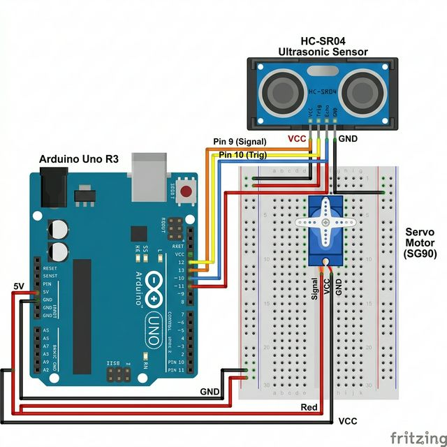

# 📡 Arduino Radar System — Complete Technical Manual

> **Arduino Uno** | HC-SR04 Ultrasonic | Servo Sweep | 16×2 LCD | Buzzer + LED Alert | Python Matplotlib



---

## 📋 Table of Contents
1. [System Overview](#system-overview)
2. [Bill of Materials](#bill-of-materials)
3. [Complete Wiring Guide](#complete-wiring-guide)
4. [Code Architecture](#code-architecture)
5. [Serial Protocol](#serial-protocol)
6. [Python Visualization](#python-visualization)
7. [Setup & Installation](#setup--installation)
8. [Troubleshooting](#troubleshooting)

---

## 1. System Overview

A radar-like object detection system that sweeps an **HC-SR04 ultrasonic sensor** back and forth on a servo motor, measuring distances at each angle. When **any obstacle** is detected, a **buzzer beeps** and a **red LED flashes**. A **16×2 LCD** displays the current angle and distance locally. The data is also streamed via serial to a **Python Matplotlib polar plot**.

```
Servo sweeps 15°→165°→15° (continuous)
         ↓
HC-SR04 pings at each degree
         ↓
Obstacle found?
  YES → Buzzer beep + LED flash + LCD: "Obj: 25cm"
  NO  → Silent + LED off + LCD: "No obstacle"
         ↓
Serial: "angle,distance\n"  →  Python radar display
```

---

## 2. Bill of Materials

| # | Component | Qty | Specs |
|---|---|---|---|
| 1 | Arduino Uno R3 | 1 | ATmega328P |
| 2 | HC-SR04 Ultrasonic Sensor | 1 | 2cm–400cm range |
| 3 | SG90 Servo Motor | 1 | 5V, 180° |
| 4 | 16×2 LCD Display | 1 | HD44780, 4-bit mode |
| 5 | 10kΩ Potentiometer | 1 | LCD contrast |
| 6 | Active Buzzer | 1 | 5V |
| 7 | Red LED (5mm) | 1 | Alert indicator |
| 8 | 220Ω Resistor | 1 | LED current limiter |
| 9 | Breadboard + Wires | — | |
| 10 | Hot Glue / Tape | — | Mount HC-SR04 on servo |

---

## 3. Complete Wiring Guide

### 3.1 HC-SR04 Ultrasonic Sensor → Arduino Uno

| HC-SR04 Pin | Wire Color | Arduino Pin | Function |
|---|---|---|---|
| **VCC** | Red | **5V** | Power |
| **Trig** | Yellow | **10** | Sends 10µs trigger pulse |
| **Echo** | Green | **11** | Returns pulse (width = distance) |
| **GND** | Black | **GND** | Ground |

**Physics:** `Distance = (echo_duration_µs × 0.034) / 2` cm

```cpp
int calculateDistance() {
  digitalWrite(trigPin, LOW);
  delayMicroseconds(2);
  digitalWrite(trigPin, HIGH);     // Fire 8 ultrasonic bursts at 40kHz
  delayMicroseconds(10);
  digitalWrite(trigPin, LOW);

  duration = pulseIn(echoPin, HIGH);  // Measure echo time
  distance = duration * 0.034 / 2;    // Convert to cm
  return distance;
}
```

---

### 3.2 SG90 Servo Motor → Arduino Uno

| Servo Wire | Color | Arduino Pin |
|---|---|---|
| **Signal** | Orange | **9** (PWM) |
| **VCC** | Red | **5V** |
| **GND** | Brown | **GND** |

**Mount the HC-SR04 on the servo horn** with hot glue so it sweeps with the arm.

```cpp
// Sweep: 15° → 165° → back
for (int i = 15; i <= 165; i++) {
  myServo.write(i);     // Move to angle
  delay(30);            // Wait for servo + sensor
  distance = calculateDistance();
  Serial.print(i); Serial.print(","); Serial.println(distance);
}
```

---

### 3.3 16×2 LCD Display → Arduino Uno

| LCD Pin | Function | Arduino Pin | Notes |
|---|---|---|---|
| **VSS** | Ground | **GND** | |
| **VDD** | Power | **5V** | |
| **VO** | Contrast | **Pot wiper** | 10kΩ potentiometer |
| **RS** | Register Select | **2** | |
| **RW** | Read/Write | **GND** | Always write mode |
| **E** | Enable | **3** | |
| **D4** | Data 4 | **4** | |
| **D5** | Data 5 | **5** | |
| **D6** | Data 6 | **6** | |
| **D7** | Data 7 | **7** | |
| **A** | Backlight + | **5V** | |
| **K** | Backlight − | **GND** | |

```cpp
LiquidCrystal lcd(2, 3, 4, 5, 6, 7);
//              RS  E  D4 D5 D6 D7

void updateLCD(int angle, int dist) {
  lcd.setCursor(0, 0);
  lcd.print("Angle: "); lcd.print(angle); lcd.print("°   ");

  lcd.setCursor(0, 1);
  if (dist > 0 && dist < MAX_RANGE) {
    lcd.print("Obj: "); lcd.print(dist); lcd.print("cm       ");
  } else {
    lcd.print("No obstacle     ");
  }
}
```

---

### 3.4 Buzzer & LED Alert

| Component | + Pin | − Pin | Notes |
|---|---|---|---|
| **Buzzer** | Arduino **8** | **GND** | Active buzzer |
| **Red LED** | Arduino **A5** | **GND** | Alert indicator |

**Alert logic:** Fires on **any valid echo** — if the sensor sees something, we alert.

```cpp
void alertCheck(int dist) {
  if (dist > 0 && dist < MAX_RANGE) {
    digitalWrite(ALERT_LED, HIGH);     // LED ON
    tone(BUZZER_PIN, 1500, 25);        // Short beep
  } else {
    digitalWrite(ALERT_LED, LOW);      // LED OFF
    noTone(BUZZER_PIN);                // Silence
  }
}
```

---

## 4. Code Architecture

### Arduino Side
```
setup()
  ├── LCD: "RADAR SYSTEM / Initializing..."
  ├── Servo attach(9)
  └── Serial.begin(9600)

loop()
  ├── Forward sweep (15° → 165°)
  │     ├── servo.write(angle)
  │     ├── delay(30ms)
  │     ├── calculateDistance()
  │     ├── alertCheck()  → buzzer + LED
  │     ├── updateLCD()   → angle + distance
  │     └── Serial: "angle,distance\n"
  └── Reverse sweep (165° → 15°)
        └── (same as above)
```

### Python Side (`radar.py`)
```
Serial connect → parse "angle,distance"
  ├── Alpha filter: new = 0.7×measured + 0.3×previous
  ├── Update beam (green sweep line)
  ├── Update scatter (red fading dots)
  └── Redraw matplotlib canvas
```

---

## 5. Serial Protocol

**Baud Rate:** `9600` | **Format:** `angle,distance\n`

| Field | Type | Range | Example |
|---|---|---|---|
| `angle` | int | 15–165 | `90` |
| `distance` | int | 0–400 | `25` |

---

## 6. Python Visualization

### Alpha Filter (False Positive Reduction)
```python
distances[idx] = (0.7 * current_dist) + (0.3 * distances[idx])
# 70% new, 30% old — smooths jitter
```

### Fading Blips
```python
alphas[idx] = 1.0           # New detection = full opacity
alphas[alphas > 0] -= 0.03  # Fade 3% per frame
# Creates classic radar sweep trail effect
```

---

## 7. Setup & Installation

### Arduino
1. Install `Servo` and `LiquidCrystal` (both built-in)
2. Board → Uno, correct Port
3. Upload `main/main.ino`

### Python
```bash
pip install pyserial matplotlib numpy
cd radar/
python radar.py
```

---

## 8. Troubleshooting

| Problem | Cause | Fix |
|---|---|---|
| Servo jitters | USB power weak | External 5V supply |
| Distance always 0 | Echo wire loose | Check pin 11 |
| LCD blank | Contrast | Turn potentiometer |
| Buzzer always on | Echoes from nearby objects | Point sensor at open space |
| Plot frozen | Wrong serial port | Edit `SERIAL_PORT` in radar.py |

---

## 📂 File Structure
```
radar/
├── main/main.ino         ← Arduino firmware (97 lines)
├── radar.py              ← Python matplotlib radar display
├── wiring_diagram.png    ← Fritzing wiring diagram
├── README.md             ← This file
└── TECH.md               ← Quick reference card
```
