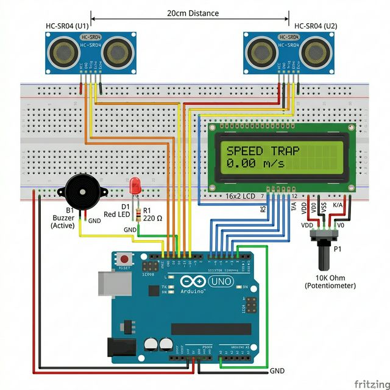

# ⚡ Speed Trap System — Complete Technical Manual

> **Arduino Uno** | Dual HC-SR04 Sensors | 16×2 LCD | Speed Alert Buzzer + LED | Web Dashboard



---

## 📋 Table of Contents
1. [System Overview](#system-overview)
2. [Bill of Materials](#bill-of-materials)
3. [Complete Wiring Guide](#complete-wiring-guide)
4. [Code Architecture](#code-architecture)
5. [Speed Calculation Physics](#speed-calculation-physics)
6. [Serial Protocol](#serial-protocol)
7. [Web Dashboard](#web-dashboard)
8. [Setup & Installation](#setup--installation)
9. [Troubleshooting](#troubleshooting)

---

## 1. System Overview

A speed measurement system using **two HC-SR04 ultrasonic sensors** placed **20 cm apart**. When an object crosses Sensor 1, a microsecond timer starts. When it crosses Sensor 2, the timer stops. The speed is calculated using `distance / time` and displayed on a **16×2 LCD** and a **web dashboard**.

If speed exceeds a configurable threshold, a **buzzer clicks and red LED flashes** 5 times.

```
Object passes →  Sensor 1 (trig=2, echo=3)  ──┐
                                                │  Time difference (µs)
Object passes →  Sensor 2 (trig=4, echo=5)  ──┘
                                                ↓
                  Speed = 0.20m / Δt seconds
                                                ↓
                  LCD shows: "0.45 m/s" + "1.6 km/h"
                  If > threshold: BUZZER + LED ALERT
```

---

## 2. Bill of Materials

| # | Component | Qty | Specs |
|---|---|---|---|
| 1 | Arduino Uno R3 | 1 | ATmega328P |
| 2 | HC-SR04 Ultrasonic Sensor | **2** | Gates 1 and 2 |
| 3 | 16×2 LCD Display | 1 | HD44780, parallel 4-bit |
| 4 | 10kΩ Potentiometer | 1 | LCD contrast |
| 5 | Active Buzzer | 1 | 5V, on pin A0 |
| 6 | Red LED (5mm) | 1 | Speed alert indicator |
| 7 | 220Ω Resistor | 1 | For LED current limiting |
| 8 | Breadboard + Wires | — | |
| 9 | Mounting surface | 1 | To fix sensors 20cm apart |

---

## 3. Complete Wiring Guide

### 3.1 Sensor 1 (Entry Gate) → Arduino Uno

| HC-SR04 Pin | Wire Color | Arduino Pin | Notes |
|---|---|---|---|
| **VCC** | Red | **5V** | Shared power rail |
| **Trig** | Yellow | **2** | Trigger for gate 1 |
| **Echo** | Green | **3** | Response from gate 1 |
| **GND** | Black | **GND** | Shared ground rail |

### 3.2 Sensor 2 (Exit Gate) → Arduino Uno

| HC-SR04 Pin | Wire Color | Arduino Pin | Notes |
|---|---|---|---|
| **VCC** | Red | **5V** | Same rail as sensor 1 |
| **Trig** | Orange | **4** | Trigger for gate 2 |
| **Echo** | Blue | **5** | Response from gate 2 |
| **GND** | Black | **GND** | Same rail as sensor 1 |

**⚠️ Critical:** The two sensors must be **exactly 20 cm apart** (center-to-center). This distance is hardcoded as `DIST_M = 0.20` in the firmware.

---

### 3.3 16×2 LCD → Arduino Uno

| Component/Pin | Arduino Pin | Function/Notes |
|---|---|---|
| **Sensor 1 Trig** | **2** | Trigger pulse (Entry) |
| **Sensor 1 Echo** | **3** | Return pulse (Entry) |
| **Sensor 2 Trig** | **4** | Trigger pulse (Exit) |
| **Sensor 2 Echo** | **5** | Return pulse (Exit) |
| **Buzzer (+)** | **A0** | Audible alert |
| **Red LED (+)** | **A1** | Visual alert (via 220Ω resistor) |
| **LCD RS** | **7** | Register Select |
| **LCD E** | **8** | Enable |
| **LCD D4** | **9** | Data 4 |
| **LCD D5** | **10** | Data 5 |
| **LCD D6** | **11** | Data 6 |
| **LCD D7** | **12** | Data 7 |
| **LCD VSS** | **GND** | Ground |
| **LCD VDD** | **5V** | Power |
| **LCD VO** | **Pot wiper** | Contrast (10kΩ potentiometer) |
| **LCD RW** | **GND** | Read/Write (write-only mode) |
| **LCD A** | **5V** | Backlight + |
| **LCD K** | **GND** | Backlight − |

```cpp
LiquidCrystal lcd(7, 8, 9, 10, 11, 12);
//              RS  E  D4 D5  D6  D7
```

---

### 3.4 Speed Alert — Buzzer & LED

| Component | + Pin | − Pin | Notes |
|---|---|---|---|
| **Buzzer** | Arduino **A0** | **GND** | Analog pins can be used as digital GPIO |
| **Red LED** | Arduino **A1** (via 220Ω resistor) | **GND** | |

```cpp
const int BUZZER_PIN = A0;  // Analog pin used as digital output
const int ALERT_LED  = A1;
const float SPEED_LIMIT_KMH = 5.0;  // Configurable threshold

// In loop(), after measuring speed:
if (speedKMH > SPEED_LIMIT_KMH) {
  lcd.setCursor(8, 1);
  lcd.print("!! FAST");
  for (int i = 0; i < 5; i++) {
    digitalWrite(ALERT_LED, HIGH);
    tone(BUZZER_PIN, 1200, 80);  // 1200Hz click
    delay(100);
    digitalWrite(ALERT_LED, LOW);
    delay(100);                   // Total: 5 × 200ms = 1 second
  }
}
```

---

## 4. Code Architecture

### State Machine
```
                   ┌──────────────┐
                   │ BOOT / CHECK │ ← New: Pings S1 & S2
                   └──────┬───────┘
                          │ Both OK?
                          ▼
                   ┌──────────────┐
                   │   WAITING    │ ← Default state
                   │  Poll Sensor 1│
                   └──────┬───────┘
                          │ d1 < 25cm (object detected)
                          │ + double-check confirmation
                          ▼
                   ┌──────────────┐
                   │   TIMING     │ ← Timer started (micros())
                   │  Poll Sensor 2│
                   └──────┬───────┘
                 ╱       │        ╲
          Timeout      d2 < 25cm   
         (4 seconds)     │         
            │            ▼         
            │     Calculate Speed  
            │     Display on LCD   
            │     Check Alert      
            ▼            │         
         WAITING ←───────┘ (3s display, then reset)
```

### Distance Measurement Function
```cpp
float measureDist(int t, int e) {
  digitalWrite(t, LOW);
  delayMicroseconds(2);
  digitalWrite(t, HIGH);
  delayMicroseconds(10);
  digitalWrite(t, LOW);
  long dur = pulseIn(e, HIGH, 25000);  // 25ms timeout ≈ 4m max range
  if (dur == 0) return 999;             // No echo = nothing there
  return (dur * 0.034) / 2;            // Convert to cm
}
```

### False Positive Prevention
The code uses **double-confirmation** before starting the timer:
```cpp
if (d1 > 1.5 && d1 < TRIGGER_CM) {   // 1st check: in range?
    delay(10);                         // Wait 10ms
    if (measureDist(trig1, echo1) < TRIGGER_CM) {  // 2nd check: still there?
      t1 = micros();                   // Confirmed — start timing
      sysState = TIMING;
    }
}
```

Why `> 1.5`? Readings below 1.5 cm are unreliable noise from the sensor itself.

---

## 5. Speed Calculation Physics

```
Speed = Distance / Time

Where:
  Distance = 0.20 meters (fixed gap between sensors)
  Time = (t2 - t1) microseconds, converted to seconds

  speedMS  = 0.20 / dt         → meters per second
  speedKMH = speedMS × 3.6     → kilometers per hour
```

**Example:**
```
t1 = 1000000 µs (when object crosses sensor 1)
t2 = 1500000 µs (when object crosses sensor 2)
dt = 0.5 seconds
speed = 0.20 / 0.5 = 0.4 m/s = 1.44 km/h
```

```cpp
unsigned long t2 = micros();
float dt = (t2 - t1) / 1000000.0;   // µs → seconds
float speedMS = DIST_M / dt;         // 0.20 / dt
float speedKMH = speedMS * 3.6;      // m/s → km/h
```

---

## 6. Serial Protocol

**Baud Rate:** `9600`

### Arduino → Python
| Tag | Example | Meaning |
|---|---|---|
| `STATE:WAITING` | | System idle, polling sensor 1 |
| `STATE:P1_CROSSED` | | Object passed gate 1, timer started |
| `STATE:P2_CROSSED` | | Object passed gate 2, speed calculated |
| `SPEED_MS:0.400` | | Speed in m/s (3 decimal places) |
| `SPEED_KMH:1.44` | | Speed in km/h (2 decimal places) |
| `ALERT:SPEED_EXCEEDED` | | Threshold crossed |
| `DEBUG_DIST_1:15.23` | | Live distance from sensor 1 |
| `DEBUG_DIST_2:22.10` | | Live distance from sensor 2 |

---

## 7. Web Dashboard

The web dashboard (`ui.py`) uses **Flask + Socket.IO + Eventlet**:

```python
# Parses serial tags and forwards to browser
if line.startswith("SPEED_MS:"):
    socketio.emit('speed_update', {'speed': line.split(":")[1], 'unit': 'm/s'})
elif line.startswith("SPEED_KMH:"):
    socketio.emit('speed_update', {'speed': line.split(":")[1], 'unit': 'km/h'})
elif line.startswith("STATE:"):
    socketio.emit('state_update', {'state': line.split(":")[1]})
elif line.startswith("DEBUG_DIST"):
    socketio.emit('debug_data', {'info': line})
```

---

## 8. Setup & Installation

### Arduino Side
1. Open Arduino IDE → Install `LiquidCrystal` (built-in)
2. Select **Board: Arduino Uno**, correct **Port**
3. Upload `main/main.ino`
4. Open Serial Monitor at **9600 baud** to verify readings

### Python Side
```bash
pip install flask flask-socketio eventlet pyserial
cd speed/
python ui.py
# Open http://localhost:5000
```

### Calibration
1. Measure the **exact** gap between the two sensors
2. Update `DIST_M` in the code (in meters):
```cpp
const float DIST_M = 0.20;  // Change to your measured distance
```
3. Adjust speed alert threshold:
```cpp
const float SPEED_LIMIT_KMH = 5.0;  // Change as needed
```

---

## 9. Troubleshooting

| Problem | Cause | Fix |
|---|---|---|
| Never triggers | Object too far | Move closer than 25cm from sensors |
| Triggers but no speed | Timeout (4s) | Pass object across both sensors quickly |
| Speed reads 0.00 | dt ≈ 0 (too fast) | Increase sensor gap |
| Speed unrealistically high | dt very small or noise | Double-confirmation should filter this |
| LCD blank | Contrast | Adjust potentiometer |
| Buzzer doesn't beep | Below threshold | Lower `SPEED_LIMIT_KMH` for testing |

---

## 📂 File Structure
```
speed/
├── main/main.ino         ← Arduino firmware (120 lines)
├── ui.py                 ← Python serial bridge + web server
├── templates/            ← Web dashboard HTML
├── wiring_diagram.png    ← Fritzing wiring diagram
├── README.md             ← This file
└── TECH.md               ← Quick reference card
```
